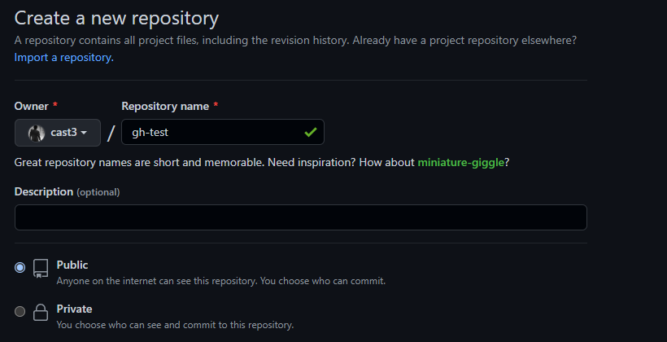
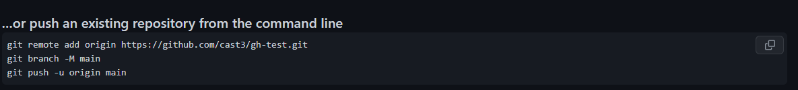
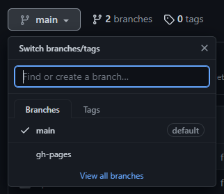
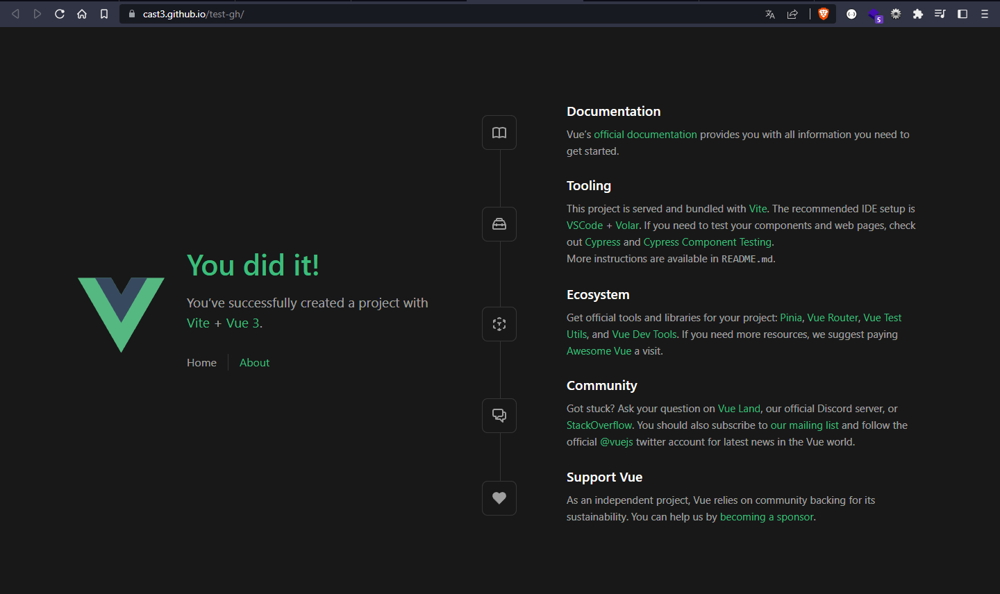

# test-gh

En esté espacio explicaré como hice el deploy de una aplicativo VUE

## 1. Creamos un repositio público con github



## 2. Creamos un nuevo proyecto
```
npm create vue@latest test-gh 
cd test-gh
```

## 3. Añadimos el paquete de gh-pages y construimos el node_modules
```
pnpm install gh-pages --save-dev
pnpm install
```
### Modificamos el package.json
```
  "scripts": {
    "dev": "vite",
    "build": "vite build",
    "preview": "vite preview",
    "lint": "eslint . --ext .vue,.js,.jsx,.cjs,.mjs --fix --ignore-path .gitignore",
    "deploy": "gh-pages -d dist"   //<--- añadimos esta linea
  },
```
### Modificamos el vite.config.js
```
export default defineConfig({
    plugins: [ vue() ],
    base: '/test-gh/', //<-- añadimos esta linea
    resolve: {
        alias: {
            '@': fileURLToPath(new URL('./src', import.meta.url))
        }
    }
})
```
## 4. Iniciamos un repositorio local y hacemos push-commit en local

```
git init
git add .
git commit -m "first commit"
```

## 5. Añadimos nuestro repositorio local al web



```
git remote add origin https://github.com/cast3/test-gh.git
git branch -M main
git push -u origin main
```
### Se añade el repositorio local al web


## 6. Ejecutamos el comando de gh-page para crear una nueva rama y subir la carpeta /dist a esta misma.
```
pnpm run deploy
```
### Se crea la rama y empieza a crear el deploy automaticamente github





## 7. Finalmente se despliega sin problemas




---
---
## Recommended IDE Setup

[VSCode](https://code.visualstudio.com/) + [Volar](https://marketplace.visualstudio.com/items?itemName=Vue.volar) (and disable Vetur) + [TypeScript Vue Plugin (Volar)](https://marketplace.visualstudio.com/items?itemName=Vue.vscode-typescript-vue-plugin).

## Customize configuration

See [Vite Configuration Reference](https://vitejs.dev/config/).

## Project Setup

```sh
npm install
```

### Compile and Hot-Reload for Development

```sh
npm run dev
```

### Compile and Minify for Production

```sh
npm run build
```

### Lint with [ESLint](https://eslint.org/)

```sh
npm run lint
```

### Deploy with gh-pages

```sh
npm run deploy
```
